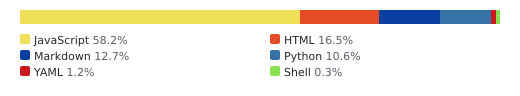
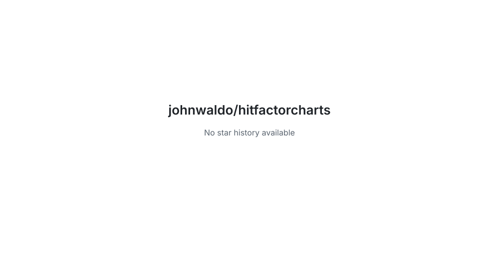

# Hit Factor Charts

<!-- aidevops:badges:start -->
<!-- managed by aidevops badges; edit the template, not this block -->
<!-- Build & Quality Status -->

<!-- License & Legal -->
[](https://github.com/johnwaldo/hitfactorcharts/blob/main/LICENSE)

<!-- Repository Metrics -->
[](docs/metrics/repo-metrics.md)
[](docs/metrics/repo-metrics.md)
[](docs/metrics/repo-metrics.md)

<!-- Project Links -->
[](https://github.com/johnwaldo/hitfactorcharts)
<!-- aidevops:badges:end -->

A Chrome extension that pulls your USPSA match results from PractiScore and displays them as interactive charts — score over time, placement, classifier tracking, and per-stage breakdowns — all inside your browser, with no server or API key required.

**[How to install](#installation)**


*Screenshots taken at v1.5.5. See [GitHub Releases](https://github.com/johnwaldo/hitfactorcharts/releases) for current versions and publication dates.*

---

## Features

- **Score over time** — raw Division % and field-strength Adjusted % plotted chronologically on a readable linear scale
- **Placement chart** — finish position at each match, normalized to field size
- **Per-stage breakdown** — expand any match row to see hits, HF, and percentage for every stage; classifier stages show official USPSA % (vs national reference HF) as the primary number; individual stages can be excluded from ratings with an optional note
- **Division-aware filtering** — automatically detects which division you shot in each match; a persistent selector filters every chart, statistic, classification, history row, and CSV export to one division
- **Field-strength adjusted %** — for non-classifier stages, takes the top hit factor from every represented division, translates each result to your division's scale using hitfactor.info HHF ratios, and measures you against the strongest normalized benchmark — a more reliable indicator of improvement than raw division % when your division draw varies
- **Experimental Time %** — an opt-in raw-time-only comparison using the fastest valid combined-field stage time divided by your raw time; classifiers, invalid times, and unavailable benchmarks are excluded
- **Chart summaries** — automatic plain-English insight below each chart: score trend (last 3 vs baseline), adjusted % context, placement percentile, and classifier trend using the national HHF reference
- **Classifier tracking** — overlay of your classifier scores against your running average; identifies each CM by number and links to the USPSA stage description PDF
- **Consistency card** — match-to-match score variance and accuracy loss metrics
- **Accuracy trend** — hit factor breakdown over time (A/C/D/M/NS/P)
- **Match type detection** — identifies USPSA, IDPA, IPSC, Steel Challenge, 3-Gun, PCSL, ICORE matches; non-USPSA matches are shown in history but excluded from charts
- **Manual type correction** — classify an unconfirmed Match History row as USPSA or another supported sport; later full fetches skip manually confirmed non-USPSA matches
- **Filter matches** — checkboxes let you include or exclude individual matches from charts without deleting them
- **Readable date ranges** — charts default to six months with one-click presets for one month, three months, six months, and one year
- **Last 8 analytics** — focus every chart, summary, classifier view, and CSV export on your eight most recent qualifying matches without re-fetching or trimming Match History
- **Export as image** — save any match or individual stage as a PNG card (floppy-disk button on each match row)
- **Export as CSV** — download all chart-visible data as a flat CSV (one row per stage) including CM numbers, USPSA %, HF, hit counts, adjusted %, and the selected reference division, class, HF, normalized HF, and benchmark method
- **Theme settings** — choose system, light, or dark brightness independently
  from blue, dark green, bright green, or purple accents; preferences sync
  across devices via Chrome storage
- **Inter font** — bundled variable font for clean, consistent rendering at all weights
- **Durable local caching** — history and preferences stay in browser storage;
  compatible schemas migrate in place, and a versioned backup can restore data
  after an unpacked-folder identity change
- **Incremental history refresh** — routine fetches scan newest PractiScore pages
  first; periodic and explicit full reconciliations catch older delayed matches
- **No external server** — everything runs locally in your browser using your existing PractiScore login session

---

## Understanding Division % vs Adjusted %

**Division %** is your score relative to the top shooter in your division at that match. It tells you how you placed that day, but it only reflects who happened to show up in your division — if no GM competed in your division, even a mediocre performance can read as 90%+.

**Adjusted %** is a field-strength correction for non-classifier stages. For each stage, the extension takes the top hit factor from every represented division, translates each result to your division's equivalent using national HHF ratios from [hitfactor.info](https://hitfactor.info), and uses the strongest normalized result as the reference. Your own division participates without conversion, so the adjusted score remains between 0% and 100% while correcting for divisions with stronger competitors.

A 75% adjusted score means your performance was 75% of the strongest normalized
stage result at that match after accounting for division equipment differences.
Adjusted % is the better indicator of improvement over time because it accounts
for the complete match field, not just your division draw. Match finish,
Adjusted %, and non-classifier stage performance can show a familiar
**≈ A Class**-style badge (D below 40%, C 40–59.999%, B 60–74.999%, A
75–84.999%, M 85–94.999%, GM 95%+), but the approximation mark means it is an
unofficial comparison—not a USPSA classification. Official classifier
percentages use the same compact class treatment without **≈**. Classifier
stages are excluded from Adjusted % because official classifier percentages are
already normalized against USPSA national division data; use **Classifiers
Only** to see that official class context.

Where captured GM hit factors are available, the stage table separately shows **HF vs GM**: your hit factor compared with the captured median GM benchmark. This is a performance comparison, not a shooter classification. Mixed or missing benchmark data remains unavailable rather than inventing a class context.

Use **Adjusted % Only** beside **Classifiers Only** to inspect the adjusted series without raw match percentages. The modes are mutually exclusive because adjusted scores exclude classifier stages. Adjusted-only mode never falls back to raw scores; when fewer than two usable adjusted matches are available, the chart explains that older matches may need to be refreshed to load non-classifier cross-division benchmark data. Switching modes uses cached data and does not fetch or rewrite match history.

Score Over Time, Adjusted % Only, Non-Classifier Stage Trend, and Classifier vs Match Score include neutral numeric reference lines at 40%, 60%, 75%, 85%, and 95%. These lines preserve a linear 0–100% scale for visual comparison only; they do not infer a USPSA class, add class-coloured bands, or change official classifier context.

**Time % (experimental)** is an optional supplemental series, not a replacement for either Division % or Adjusted %. Each usable non-classifier stage is `fastest valid combined-field raw time / your raw time × 100`, capped at 100%; a match point is the arithmetic mean of its usable stages. It does not apply division or power-factor weighting, and never substitutes hit factor, a division winner, or a guessed benchmark. A match with no usable stage times is unavailable.

---

## Requirements

- Google Chrome (or any Chromium-based browser that supports Manifest V3 extensions)
- A [PractiScore](https://practiscore.com) account with match history

---

## Installation

Chrome does not allow side-loading extensions from a zip file directly, so you load the extension folder manually. This takes about 30 seconds.

### 1 — Download the extension

**Option A — Download a release (recommended)**

1. Go to the [Releases page](https://github.com/johnwaldo/hitfactorcharts/releases)
2. Download the latest `HitFactorCharts.zip`
3. Unzip the archive anywhere on your computer

**Option B — Clone the repo**

```bash
git clone https://github.com/johnwaldo/hitfactorcharts.git
```

### 2 — Open Chrome Extensions

Navigate to `chrome://extensions` in your browser, or:

- Open Chrome menu → **More tools** → **Extensions**

### 3 — Enable Developer Mode

In the top-right corner of the Extensions page, toggle on **Developer mode**.

### 4 — Load the extension

1. Click **Load unpacked**
2. Navigate to the unzipped folder — if you used Option A (release ZIP), select the top-level unzipped folder; if you used Option B (cloned repo), select the `extension/` subfolder (the one containing `manifest.json`)
3. Click **Select Folder**

The Hit Factor Charts icon will appear in your Chrome toolbar. Pin it for easy access via the puzzle-piece menu.

### Updating without losing local history

Chrome keys unpacked-extension storage to the extension identity. Reloading the
same loaded directory preserves that identity and all local history. Removing
the extension or loading the same files from a different path can create a
different identity with an empty storage namespace.

1. Open Hit Factor Charts and click **Back up data**.
2. Replace the files *inside the directory currently loaded by Chrome*. Keep the
   directory path unchanged.
3. Open `chrome://extensions` and click **Reload** on Hit Factor Charts. Do not
   remove the extension or load a newly named/versioned folder.
4. Reopen the dashboard and confirm the cached history and preferences are present.

If the folder or extension identity already changed, load the new copy, click
**Restore backup**, and choose the JSON backup. Restore validates the format,
size, cache ownership, and data types before writing. A backup for a different
member requires explicit confirmation. Full match history remains in
`chrome.storage.local`; only compact credentials and theme preferences use
`chrome.storage.sync` because sync storage is too small for score history.

---

## Usage

1. **Log in to PractiScore** — visit [practiscore.com](https://practiscore.com) and sign in normally. The extension uses your existing browser session.

2. **Open Hit Factor Charts** — click the Hit Factor Charts icon in the toolbar. The dashboard opens in a new tab.

3. **Enter your member number and/or name** — type your USPSA member number (e.g. `A12345`) and/or your name as it appears on result sheets (e.g. `Smith, Jane`). At least one is required; providing both improves match accuracy.

4. **Choose your division and a Fetch timeline, then click Fetch Scores** — a
   division is required. The timeline defaults to **6 mo** and offers **Last 1
   month**, **3 mo**, **6 mo**, and **1 yr**. It limits which PractiScore matches
   receive score and stage requests. The extension opens each in-range match's
   results page, selects your division, and records your score. Keep the
   PractiScore tab open and complete any CAPTCHA or Cloudflare verification that
   appears there; longer history pulls may ask more than once. Progress is shown
   in the status bar.

5. **Explore your data** — the summary bar shows matches found, average %, best %, field-strength adjusted average, and your USPSA classification. The **Scored Matches / All Matches** toggle below the cards switches between member-number lookup results and all name-matched results.

### Filtering by division

Choose a named USPSA division before fetching scores. The saved selection limits the complete dashboard to that division, including charts, statistics, classifier analysis, Match History, status counts, and CSV exports. Changing it does not re-fetch or delete scores from other divisions.

### Reading the chart summaries

Compact insight tiles below every analytics chart show the value, comparison
basis, sample size, and a visible status. Arrows and colour reinforce the words
**Improving**, **Stable**, and **Needs attention**; they never carry meaning
alone. Tiles stay synchronized with the selected division, date range,
Scored/All view, Last 8 setting, match checkboxes, and stage filters.

- **Score Over Time** — last 3 match average vs the prior baseline, adjusted
  average vs paired raw results, and least-squares first-to-last trends for raw
  and adjusted percentages. **Stable** means within ±1.0 percentage point.
- **Placement Over Time** — average field beaten, last 3 vs the prior baseline,
  and best and worst finite placement in the filtered view. A higher field-beaten
  percentage is better; **Stable** means within ±1.0 point. Placement percentages
  never receive class badges.
- **Non-Classifier Stage Trend** — last 3 vs prior, the overall match-relative
  trend, and best and worst finite stage performance in the filtered view.
  Eligible values may show the explicitly approximate class shorthand, but these
  remain comparisons with each match's top shooter—not USPSA classifications.
- **Classifier vs Match Score** — recent classifier performance, best
  classifier, match average when classifiers were present, and Pearson
  correlation between paired per-match values. Correlation requires at least 3
  varying pairs, reports `r` and `n`, and describes association rather than
  causation. Official USPSA percentages are preferred; any match-relative
  fallback is labelled.
- **Accuracy Trend** — recent-vs-prior reported A/B/C/D/M/NS percentage shares
  of valid reported hits. Its disclosed nonlinear geometry expands 0–5%, gives
  values below 40% most of the chart height, and compresses values above 50%; all
  labels, tooltips, summaries, and exports retain exact raw percentages. Higher A
  and lower B/C/D/M/NS are treated as improvement.
- **Hit Zone Breakdown** — average A/B/C/D/M/NS shares and their overall
  percentage-point trends. Procedurals remain outside the denominator.

Recent-vs-prior trends require at least 4 results. Least-squares trends require
at least 3. Classifier recent trends require at least 6 stages and use a
±1.5-point Stable threshold. Insufficient metrics remain visibly unavailable
rather than appearing as zero. Combined M+NS values always remain combined and
show their own sample basis.

The **Non-Classifier Stage Trend** averages your included non-classifier stage percentages for each match. Each percentage compares your hit factor with the top shooter on that stage at that match. It uses a linear 0–100% scale and is useful for tracking match-relative performance, but it is not an official USPSA classification percentage and does not use GM/M/A/B/C/D bands. Its 40%, 60%, 75%, 85%, and 95% lines are numeric percentage references only.

The **Hit Zone Breakdown** uses the reported A/B/C/D/M/NS columns for included stages, after all active date, division, match-type, stage, Last 8, and match-selection filters. It then displays the six most recent eligible matches in chronological order. B appears only when a positive B count is reported. Separate M and NS source columns remain separate; a combined source column is labelled **M+NS** and is never split. Older cached stages without column-availability metadata show blanks until that match is refreshed, so an unavailable field is not presented as an authoritative zero.

Accuracy Trend and hit-zone percentages use the **reported hit-zone total** as their denominator. A match with missing hit data or a zero denominator is unavailable rather than shown as 0%. Procedural penalties are disclosed but excluded. Raw counts and percentages remain unchanged in tooltips and exports. Accuracy Trend maps raw 0%, 5%, 10%, 20%, 40%, 50%, and 100% to 0%, 30%, 45%, 62%, 84%, 90%, and 100% of visual height; the Hit Zone chart separately maps cumulative raw boundaries from 0–75% to 0–45% of visual height and 75–100% to 45–100%. The chart deliberately remains a stacked bar chart: pie charts and 3D/perspective effects would distort comparisons.

### Filtering by date

Analytics open on the most recent **6 mo** so trends stay readable. Use the buttons above the charts to switch to **Last 1 month**, **3 mo**, **6 mo**, or **1 yr**. The active range applies to every chart, summary statistic, classifier-only view, and chart CSV export without re-fetching or deleting older Match History records. After a successful fetch, ranges outside the verified fetched timeline are greyed out and explain on hover or keyboard focus that a longer Fetch timeline is required. Successful broader fetches remain available after later narrower fetches and after reload.

The **Last 8 matches** switch applies after the active analytics date range, division, Scored/All view, and manually selected matches. Turn it on to use the most recent eight qualifying matches across every chart, summary, classifier analysis, and chart CSV export. If fewer than eight qualify, all available matches are used. The preference is remembered, while Match History and cached records remain complete.

The **Fetch timeline** dropdown beside **Fetch Scores** is separate: it limits
score and stage requests and remembers your last choice. A narrower fetch merges
new results with older cached Match History instead of deleting it. After one
complete history scan establishes trusted sync metadata, routine refreshes scan
newest PractiScore pages first and stop only after two settled pages contain no
unknown IDs at or before the stored high-water date. Unknown or corrupt metadata
falls back to full pagination. Same-date IDs remain distinct, and an incomplete
page never deletes older rows or coverage.

Click **Full history reconciliation** to scan every available history page while
still reusing complete same-member score caches. The extension also performs a
full reconciliation after ten incremental runs or fourteen days, whichever
comes first, so older delayed or backfilled matches are eventually discovered.
Matches explicitly recorded as complete for the same member are reused without
score or stage requests. Compatible cache schemas migrate in place; unknown or
partial records are repaired non-destructively, preserving successful stages
and stage filters if a retry remains incomplete. The status and progress log
report pages scanned, incremental/full mode, stop or fallback reason, newly
discovered matches, cache reuse, repairs, and stage outcomes. Changing the
dropdown or Last 8 switch alone does not make a request, and refreshing one
match remains unrestricted.

### Exporting data

**As image:** Click the floppy-disk icon on any match row to open the export menu. Choose **Full Match** for a match summary card or any individual stage for a per-stage card. Both download as PNG at 2× resolution. Stage cards preserve separate M/NS or an explicitly combined M+NS value and omit unavailable hit columns.

**As CSV:** Click **⤓ CSV** in the chart section header to download the same final analytics dataset shown by the charts as a spreadsheet. One row per stage, includes match name, division, class, overall %, div %, placement, stage HF, time, reported hit counts (A/B/C/D/M/NS/M+NS/P), classifier number, and official USPSA %. Unavailable source columns remain blank; reported zeroes remain zero. When no rows qualify, no file is downloaded; the status message explains whether the active division/date range, Scored view, unchecked matches, or Classifiers Only mode excluded the data.

### Filtering matches

Each USPSA match row has a checkbox. Uncheck a match to exclude it from charts without deleting it.

Rows that remain **Unknown** after automatic match-type detection include a **Type** selector. Choose USPSA, IDPA, IPSC, Steel Challenge, 3-Gun, PCSL, or ICORE to update chart inclusion, badges, and status counts immediately without fetching. The choice is stored separately from score history; **Keep unconfirmed** resets to automatic behavior without deleting cached scores or stages. Later full Fetch Scores runs skip matches manually classified as non-USPSA, reducing unnecessary PractiScore requests, while explicit single-match refresh remains available.

### Filtering stages

Expand a match row to manage individual stages. Each stage is selected by default. Uncheck **Factor**, optionally add a note such as “gun broke,” then click **Apply stage filters** to omit that stage from match performance, adjusted %, accuracy, and hit-zone aggregates while keeping it visible in the history table.

### Refreshing a single match

Each match row has a refresh button (↻). Click it to re-fetch just that match without re-scraping your entire history.

### Deleting a match

Click the delete button (✕) on a match row to permanently remove it from history and cache.

### Clearing all data

Use the **⚠ Clear All Data** button in the header to wipe all cached scores from browser storage and start fresh.

---

## Privacy

- No data ever leaves your browser. All scraping happens locally via Chrome's tab and scripting APIs.
- Your PractiScore credentials are never accessed by the extension — it only uses your existing login session cookies.
- Match data is stored in `chrome.storage.local` on your device only.

---

## Troubleshooting

| Symptom | Fix |
|---------|-----|
| "No score data found" | Make sure you are logged in to PractiScore, then click Fetch Scores again |
| Scores show 0% or wrong division | Your name in the Name field must match the result sheet exactly (e.g. `Doe, John`) |
| Extension doesn't appear | Confirm Developer Mode is on and you loaded the `extension/` subfolder, not the repo root |
| Match list is empty | Visit [practiscore.com/associate/step2](https://practiscore.com/associate/step2) while logged in to verify your history is accessible |
| History appears empty after an update | The unpacked folder path may have changed. Load the intended copy and use **Restore backup**; for future updates, replace files in the loaded folder and click **Reload** |
| An older delayed match is missing | Click **Full history reconciliation**; routine refreshes also trigger a periodic full scan |

---

## Building a release ZIP

A helper script is included to package the extension for distribution:

```bash
./build.sh
```

This creates `dist/HitFactorCharts.zip` containing only the extension files, ready to share or submit to the Chrome Web Store.

### Release checklist

Before bumping `extension/manifest.json` and publishing a GitHub release:

1. Update `CHANGELOG.md` with user-facing feature, fix, and documentation callouts for the new version.
2. Run `./build.sh` and the syntax checks listed in recent PRs.
3. Push the release commit to `main`; the release workflow uses the matching changelog section for GitHub release notes.

---

## Project structure

```
extension/          ← Load this folder in Chrome
  manifest.json
  background.js     ← Service worker: scraping and fetch logic
  dashboard.html    ← Dashboard UI
  dashboard.js      ← Dashboard state, analytics, and orchestration
  dashboard-charts.js   ← Chart geometry and canvas drawing
  dashboard-summaries.js ← Analytics summary helpers
  dashboard-exports.js  ← CSV and PNG exports
  dashboard-history.js  ← Match History rendering and actions
  fonts/
    Inter-Variable.woff2  ← Bundled Inter variable font (latin, 100–900)
  icons/
    icon16.png
    icon48.png
    icon128.png
build.sh            ← Packages extension/ into dist/HitFactorCharts.zip
```

<!-- aidevops:managed-readme:start -->
<!-- managed by aidevops; refresh with managed-readme-helper.sh sync -->
## Star History



## Built with aidevops

This project was created and is maintained with
[aidevops.sh](https://aidevops.sh).

[View johnwaldo on GitHub](https://github.com/johnwaldo) ·
[aidevops repository](https://github.com/marcusquinn/aidevops)
<!-- aidevops:managed-readme:end -->
